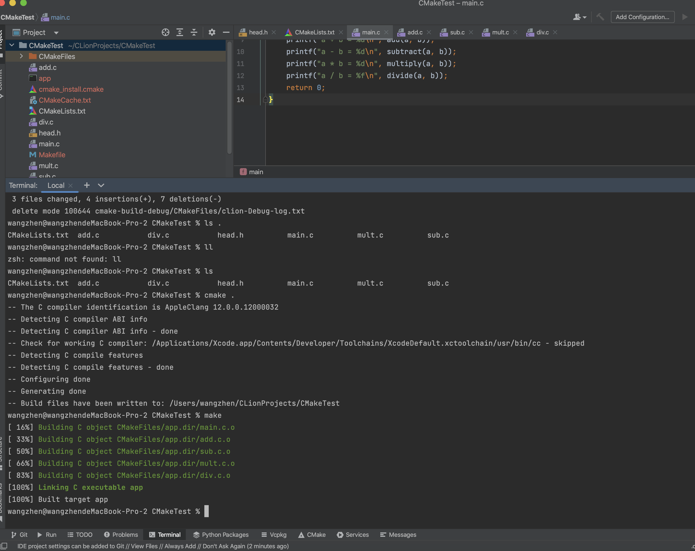
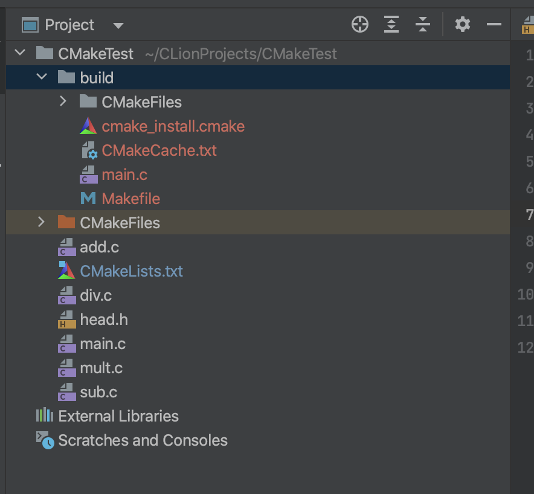

# cmake学习笔记

参考如下的文档：

+ [CMake 保姆级教程（上）](https://subingwen.cn/cmake/CMake-primer/index.html)
+ [CMake 保姆级教程（下）](https://subingwen.cn/cmake/CMake-advanced/)


> CMake看成一款自动生成 Makefile的工具，其编译流程如下图：
>
> 


本人在MacOS上，使用CLion IDE编写代码测试

cmake之后再make，会多出许多新的文件




这样会导致整个项目目录看起来很混乱，不太容易管理和维护

可以把生成的这些与项目源码无关的文件统一放到一个对应的目录里边

```shell
mkdir build
cd ./build
cmake ..
make
```




