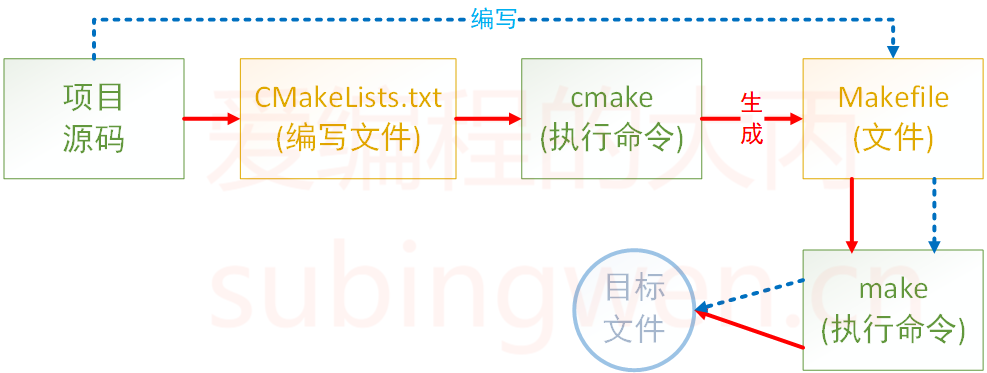

# cmake学习笔记

参考如下的文档：

+ [CMake 保姆级教程（上）](https://subingwen.cn/cmake/CMake-primer/index.html)
+ [CMake 保姆级教程（下）](https://subingwen.cn/cmake/CMake-advanced/)

> CMake看成一款自动生成 Makefile的工具，其编译流程如下图：
>
> 

本人在MacOS上，使用CLion IDE编写代码测试

