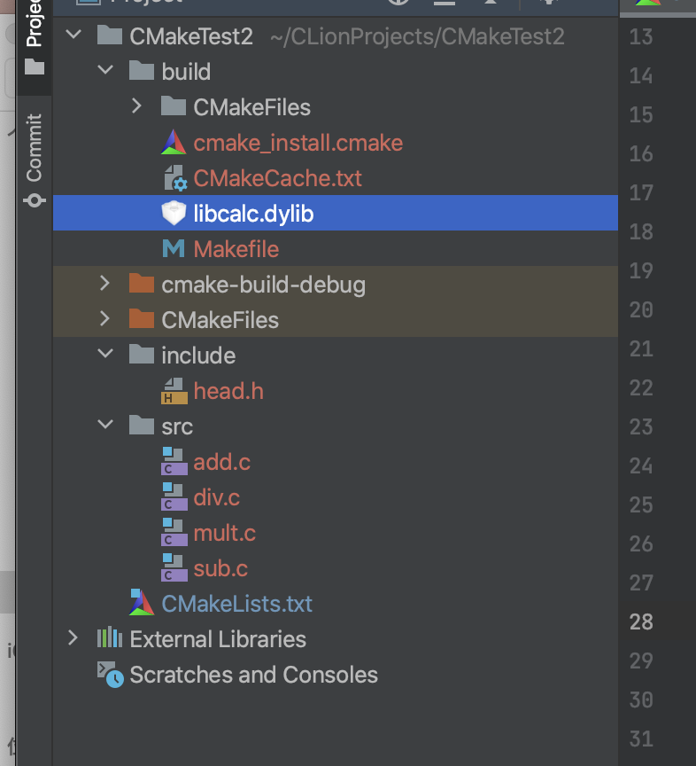
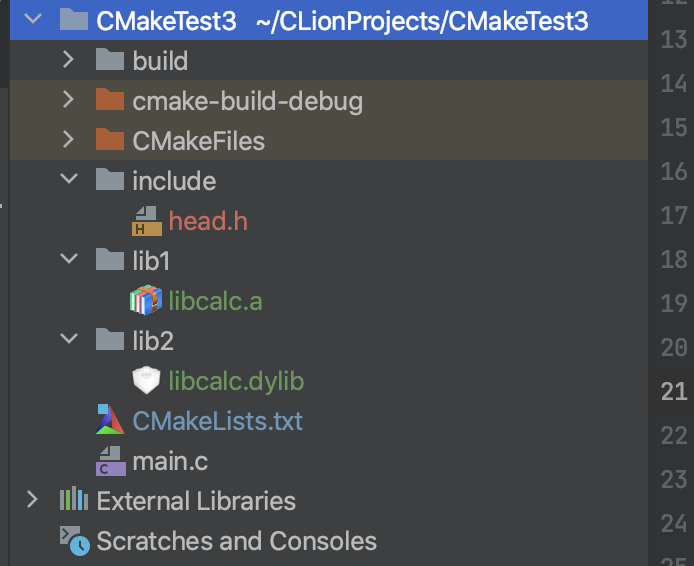

# cmake学习笔记

B站的视频教程不错：

+ [CMake 保姆级教程【C/C++】](https://www.bilibili.com/video/BV14s4y1g7Zj/?p=2&spm_id_from=pageDriver&vd_source=308fc9b57cdc925a463da02262234ff6)

其对应的文档教程为：

+ [CMake 保姆级教程（上）](https://subingwen.cn/cmake/CMake-primer/index.html)
+ [CMake 保姆级教程（下）](https://subingwen.cn/cmake/CMake-advanced/)


## 注释

使用 `#[[ ]]` 形式进行块注释


## cmake_minimum_required

`cmake_minimum_required`指定使用的 `cmake` 的最低版本

```cmake
cmake_minimum_required(VERSION 3.24)
```


## project

`project`定义工程名称，并可指定工程的版本、工程描述、web主页地址、支持的语言（默认情况支持所有语言），如果不需要这些都是可以忽略的，只需要指定出工程名字即可

```cmake
project(CMakeTest C)
```


## add_executable

`add_executable`定义工程会生成一个可执行程序

```cmake
add_executable(可执行程序名 源文件名称)
```

这里的可执行程序名和`project`中的项目名没有任何关系

源文件名可以是一个也可以是多个，如有多个可用空格或`;`间隔

```cmake
# 样式1
add_executable(app add.c div.c main.c mult.c sub.c)
# 样式2
add_executable(app add.c;div.c;main.c;mult.c;sub.c)
```


## set

### 1.定义变量

```cmake
# SET 指令的语法是：
# [] 中的参数为可选项, 如不需要可以不写
SET(VAR [VALUE] [CACHE TYPE DOCSTRING [FORCE]])
```

+ `VAR`：变量名

+ `VALUE`：变量值

如：

```cmake
# 方式1: 各个源文件之间使用空格间隔
# set(SRC_LIST add.c  div.c   main.c  mult.c  sub.c)

# 方式2: 各个源文件之间使用分号 ; 间隔
set(SRC_LIST add.c;div.c;main.c;mult.c;sub.c)
add_executable(app  ${SRC_LIST})
```


### 2.指定使用的C++标准

C++标准对应有一宏叫做`DCMAKE_CXX_STANDARD`

在CMake中想要指定C++标准有两种方式

1.在 `CMakeLists.txt` 中通过 `set` 命令指定

```cmake
#增加-std=c++11
set(CMAKE_CXX_STANDARD 11)
#增加-std=c++14
set(CMAKE_CXX_STANDARD 14)
#增加-std=c++17
set(CMAKE_CXX_STANDARD 17)
```


2.在执行 cmake 命令的时候指定出这个宏的值

```cmake
#增加-std=c++11
cmake CMakeLists.txt文件路径 -DCMAKE_CXX_STANDARD=11
#增加-std=c++14
cmake CMakeLists.txt文件路径 -DCMAKE_CXX_STANDARD=14
#增加-std=c++17
cmake CMakeLists.txt文件路径 -DCMAKE_CXX_STANDARD=17
```


### 3.指定输出的路径

`EXECUTABLE_OUTPUT_PATH`宏表示输出的路径

```cmake
set(HOME /home/robin/Linux/Sort)
set(EXECUTABLE_OUTPUT_PATH ${HOME}/bin)
```

+ 第一行：定义一个变量用于存储一个绝对路径
+ 第二行：将拼接好的路径值设置给`EXECUTABLE_OUTPUT_PATH`宏
+ 如果这个路径中的子目录不存在，会自动生成，无需自己手动创建


## 搜索文件

> `PROJECT_SOURCE_DIR`为包含`PROJECT()`的最近一个`CMakeLists.txt`文件所在的文件夹
>
> 参考：
>
> + [cmake中PROJECT_SOURCE_DIR的遐思](https://blog.csdn.net/wangxiao7474/article/details/112967433)


> `CMAKE_CURRENT_SOURCE_DIR`指的是当前处理的 `CMakeLists.txt` 所在的路


如果不确定的话，可输出，如：

```cmake
message("PROJECT_SOURCE_DIR: ${PROJECT_SOURCE_DIR}")
```


如果一个项目里边的源文件很多，在编写`CMakeLists.txt`文件的时候不可能将项目目录的各个文件一一罗列出来，这样太麻烦也不现实。所以，在`CMake`中为我们提供了搜索文件的命令，可以使用`aux_source_directory`命令或者`file`命令。


### 1.aux_source_directory

```cmake
aux_source_directory(< dir > < variable >)
```

+ `dir`：要搜索的目录

+ `variable`：将从dir目录下搜索到的源文件列表存储到该变量中


如：

```cmake
# 搜索 src 目录下的源文件
aux_source_directory(${CMAKE_CURRENT_SOURCE_DIR}/src SRC_LIST)
add_executable(app  ${SRC_LIST})
```


### 2.file

```cmake
file(GLOB/GLOB_RECURSE 变量名 要搜索的文件路径和文件类型)
```

+ `GLOB`: 将指定目录下搜索到的满足条件的所有文件名生成一个列表，并将其存储到变量中。
+ `GLOB_RECURSE`：递归搜索指定目录，将搜索到的满足条件的文件名生成一个列表，并将其存储到变量中。

搜索当前目录的src目录下所有的源文件，并存储到变量中

```cmake
file(GLOB MAIN_SRC ${CMAKE_CURRENT_SOURCE_DIR}/src/*.cpp)
file(GLOB MAIN_HEAD ${CMAKE_CURRENT_SOURCE_DIR}/include/*.h)
```


## 包含头文件

```cmake
# 指定头文件路径
include_directories(${CMAKE_CURRENT_SOURCE_DIR}/include)
```


## 制作动态库或静态库

有些时候我们编写的源代码并不需要将他们编译生成可执行程序，而是生成一些静态库或动态库提供给第三方使用


### 制作静态库

```cmake
add_library(库名称 STATIC 源文件1 [源文件2] ...) 
```

> 在Linux中，静态库名字分为三部分：lib+库名字+.a，此处只需要指定出库的名字就可以了，另外两部分在生成该文件的时候会自动填充。
>
> 在Windows中虽然库名和Linux格式不同，但也只需指定出名字即可。
>


### 制作动态库

```cmake
add_library(库名称 SHARED 源文件1 [源文件2] ...) 
```

> 在Linux中，动态库名字分为三部分：lib+库名字+.so，此处只需要指定出库的名字就可以了，另外两部分在生成该文件的时候会自动填充。
>
> 在Windows中虽然库名和Linux格式不同，但也只需指定出名字即可。
>


如：

```cmake

file(GLOB SRC ${CMAKE_CURRENT_SOURCE_DIR}/src/*.c)

# 指定头文件路径
include_directories(${CMAKE_CURRENT_SOURCE_DIR}/include)

add_library(calc SHARED ${SRC})
```




### 库怎么用？

库需要发布给使用者，需要发布2部分数据

+ 库文件
+ 头文件，include中的文件


###  指定输出的路径

####  适用于动态库

通过`set`命令给`EXECUTABLE_OUTPUT_PATH`宏设置了一个路径，这个路径就是可执行文件生成的路径。 

```cmake
cmake_minimum_required(VERSION 3.0)
project(CALC)
include_directories(${PROJECT_SOURCE_DIR}/include)
file(GLOB SRC_LIST "${CMAKE_CURRENT_SOURCE_DIR}/src/*.cpp")
# 设置动态库生成路径
set(EXECUTABLE_OUTPUT_PATH ${PROJECT_SOURCE_DIR}/lib)
add_library(calc SHARED ${SRC_LIST})
```


#### 都适用

由于在Linux下生成的静态库默认不具有可执行权限，所以在指定静态库生成的路径的时候就不能使用`EXECUTABLE_OUTPUT_PATH`宏了，而应该使用`LIBRARY_OUTPUT_PATH`，这个宏对应静态库文件和动态库文件都适用

```cmake
cmake_minimum_required(VERSION 3.0)
project(CALC)
include_directories(${PROJECT_SOURCE_DIR}/include)
file(GLOB SRC_LIST "${CMAKE_CURRENT_SOURCE_DIR}/src/*.cpp")
# 设置动态库/静态库生成路径
set(LIBRARY_OUTPUT_PATH ${PROJECT_SOURCE_DIR}/lib)
# 生成动态库
#add_library(calc SHARED ${SRC_LIST})
# 生成静态库
add_library(calc STATIC ${SRC_LIST})
```


## 包含库文件

如下的目录：




### 链接静态库

```cmake
link_libraries(<static lib> [<static lib>...])
```

+ 参数1：指定出要链接的静态库的名字

  + 可以是全名 `libxxx.a`

  + 也可以是掐头（lib）去尾（.a）之后的名字 `xxx`

+ 参数2-N：要链接的其它静态库的名字


如果该静态库不是系统提供的（自己制作或者使用第三方提供的静态库）可能出现静态库找不到的情况，此时可以将静态库的路径也指定出来：

```cmake
link_directories(<lib path>)
```


如下的例子，如果不指定`link_directories`，则会有如下的提示：


修改后如下：

```cmake
# 链接静态库
link_libraries(calc)
link_directories(${CMAKE_CURRENT_SOURCE_DIR}/lib1)
```


### 链接动态库

```cmake
target_link_libraries(
    <target> 
    <PRIVATE|PUBLIC|INTERFACE> <item>... 
    [<PRIVATE|PUBLIC|INTERFACE> <item>...]...)
```


+ `target`：指定要加载动态库的文件的名字

  + 该文件可能是一个源文件

  + 该文件可能是一个动态库文件
  + 该文件可能是一个可执行文件


+ `PRIVATE|PUBLIC|INTERFACE`：动态库的访问权限，默认为PUBLIC

> 如果各个动态库之间没有依赖关系，无需做任何设置，三者没有没有区别，一般无需指定，使用默认的 `PUBLIC` 即可。
>
> 动态库的链接具有传递性，如果动态库 A 链接了动态库B、C，动态库D链接了动态库A，此时动态库D相当于也链接了动态库B、C，并可以使用动态库B、C中定义的方法。
>
> ```cmake
> target_link_libraries(A B C)
> target_link_libraries(D A)
> ```
>
> + `PUBLIC`：在public后面的库会被Link到前面的target中，并且里面的符号也会被导出，提供给第三方使用。
> + `PRIVATE`：在private后面的库仅被link到前面的target中，并且终结掉，第三方不能感知你调了啥库
> + `INTERFACE`：在interface后面引入的库不会被链接到前面的target中，只会导出符号。


在cmake中指定要链接的动态库的时候，**应该将命令写到生成了可执行文件之后**：

```cmake
cmake_minimum_required(VERSION 3.0)
project(TEST)
file(GLOB SRC_LIST ${CMAKE_CURRENT_SOURCE_DIR}/*.cpp)
# 添加并指定最终生成的可执行程序名
add_executable(app ${SRC_LIST})
# 指定可执行程序要链接的动态库名字
target_link_libraries(app pthread)
```


在`target_link_libraries(app pthread)`中：

+ `app`: 对应的是最终生成的可执行程序的名字
+ `pthread`：这是可执行程序要加载的动态库，这个库是系统提供的线程库，全名为`libpthread.so`，在指定的时候一般会掐头（`lib`）去尾（.so）。


#### 链接第三方动态库

在 CMake 中可以在生成可执行程序之前，通过命令指定出要链接的动态库的位置，指定静态库位置使用的也是这个命令

```cmake
link_directories(path)
```

所以修改之后的`CMakeLists.txt`文件应该是这样的：

```cmake
cmake_minimum_required(VERSION 3.0)
project(TEST)
file(GLOB SRC_LIST ${CMAKE_CURRENT_SOURCE_DIR}/*.cpp)
# 指定源文件或者动态库对应的头文件路径
include_directories(${PROJECT_SOURCE_DIR}/include)
# 指定要链接的动态库的路径
link_directories(${PROJECT_SOURCE_DIR}/lib)
# 添加并生成一个可执行程序
add_executable(app ${SRC_LIST})
# 指定要链接的动态库
target_link_libraries(app pthread calc)
```


> **使用 `target_link_libraries` 命令就可以链接动态库，也可以链接静态库文件。**


