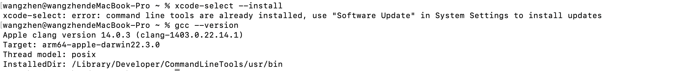
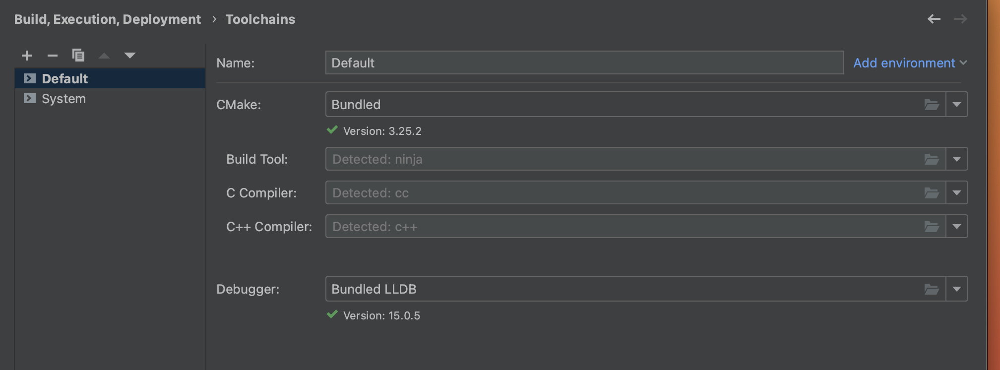
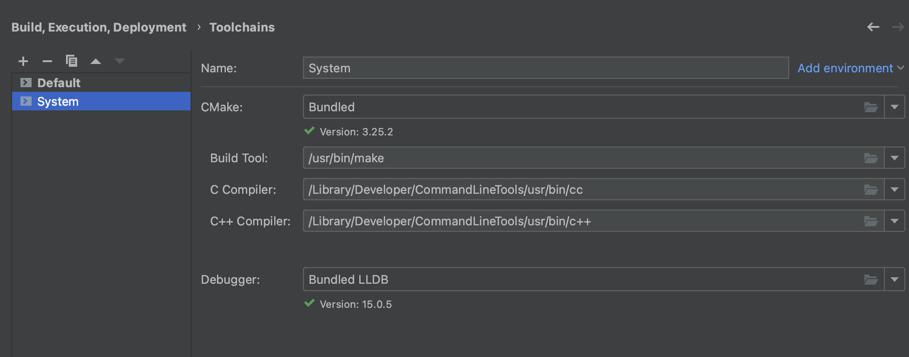
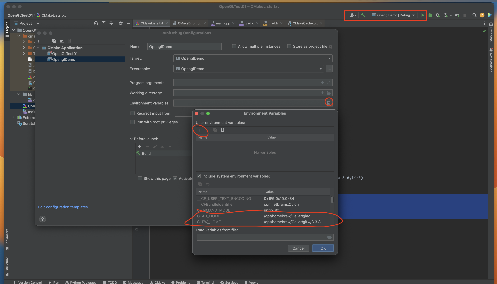
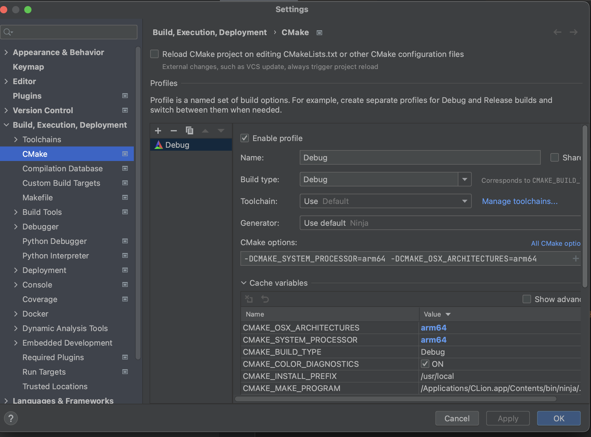
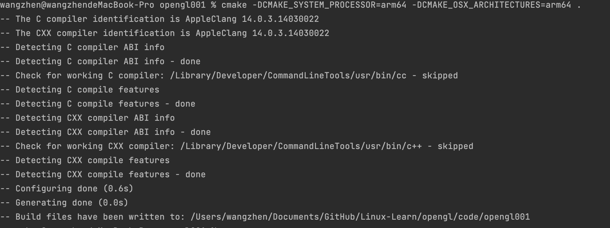

# MacOS CLion OpenGL配置

在MacOS系统下，使用CLion进行OpenGL开发

本人电脑为Apple M2 Pro，所以在实践中也遇到一些问题

主要配置参考：

+ [Setup OpenGL Development with Clion on MacOS](https://broadgeek.com/2021/01/12/2236/)


## 环境配置

### Homebrew

按照官方文档[Install Homebrew](https://brew.sh/)安装，但在国内安装有网络方面的问题

可按清华的镜像[Homebrew / Linuxbrew 镜像使用帮助](https://mirrors.tuna.tsinghua.edu.cn/help/homebrew/)进行安装


### gcc

这个可通过安装Xcode来一起安装

```shell
xcode-select --install
```

通过`gcc --version` 来检查是否安装




通过`clang --version`来检查clang版本


### CLion

安装CLion后，不知道为啥我的toolchains和上面的文档中不一样



后来自己又加了一个，参考[4.1. Select toolchain](https://cwiki.apache.org/confluence/pages/viewpage.action?pageId=95651665)，不知道对最后的结构有啥影响不




### 配置有关OpenGL的开发环境

这一步按照教程中的来

但我在最后的cmake时，却提示找到系统的环境变量，估计是新建CLion工程是没识别到，可进行如下的配置




## 遇到的问题

1.提示`building for macOS-x86_64 but attempting to link with file built for macOS-arm64`

参考：

+ [MacBook pro M1上手折腾日志](https://zhuanlan.zhihu.com/p/348532259)

+ [Mac(m1) clion编译opencv报错building for macOS-x86_64 but attempting to link with file built for macOS-ar](https://blog.csdn.net/gp18391818575/article/details/126553784)

配置如下：

```sh
-DCMAKE_SYSTEM_PROCESSOR=arm64 -DCMAKE_OSX_ARCHITECTURES=arm64
```




也可以执行如下的cmake命令：

```cmake
cmake -DCMAKE_SYSTEM_PROCESSOR=arm64 -DCMAKE_OSX_ARCHITECTURES=arm64 .
```




## 运行

代码可参考[]()


