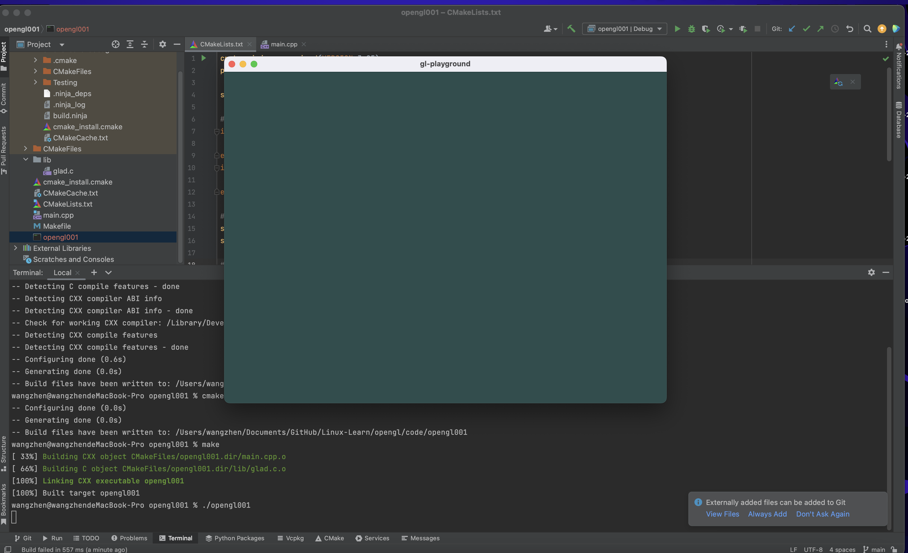

# 窗口

参考：

+ [你好，窗口](https://learnopengl-cn.github.io/01%20Getting%20started/03%20Hello%20Window/)


代码地址为：

+ [opengl001](https://github.com/winfredzen/Linux-Learn/tree/main/opengl/code/opengl001)


 `main.cpp` 代码如下，具体的见注释：

```c++
#include <iostream>
#include <glad/glad.h>
#include <GLFW/glfw3.h>

// 设置
const unsigned int SCR_WIDTH = 800;
const unsigned int SCR_HEIGHT = 600;

void draw_frame();
void framebuffer_size_callback(GLFWwindow* window, int width, int height);
void processInput(GLFWwindow* window);


int main()
{
    //调用glfwInit函数来初始化GLFW
    glfwInit();
    //使用glfwWindowHint函数来配置GLFW
    //将主版本号(Major)和次版本号(Minor)都设为3
    glfwWindowHint(GLFW_CONTEXT_VERSION_MAJOR, 3);
    glfwWindowHint(GLFW_CONTEXT_VERSION_MINOR, 3);
    //告诉GLFW我们使用的是核心模式(Core-profile)
    glfwWindowHint(GLFW_OPENGL_PROFILE, GLFW_OPENGL_CORE_PROFILE);

#ifdef __APPLE__
    //Mac OS X系统需要加入下面的代码
    glfwWindowHint(GLFW_OPENGL_FORWARD_COMPAT, GL_TRUE);
#endif

    //创建一个窗口对象，这个窗口对象存放了所有和窗口相关的数据，而且会被GLFW的其他函数频繁地用到
    GLFWwindow* window = glfwCreateWindow(SCR_WIDTH, SCR_HEIGHT, "LearnOpenGL", NULL, NULL);
    if (window == nullptr) {
        std::cout << "failed to create GLFW window" << std::endl;
        glfwTerminate();
        return -1;
    }
    //通知GLFW将我们窗口的上下文设置为当前线程的主上下文了
    glfwMakeContextCurrent(window);

    //GLAD是用来管理OpenGL的函数指针的，所以在调用任何OpenGL的函数之前我们需要初始化GLAD
    if (!gladLoadGLLoader((GLADloadproc) glfwGetProcAddress)) {
        std::cout << "failed to initialize GLAD" << std::endl;
        glfwTerminate();
        return -1;
    }

    //必须告诉OpenGL渲染窗口的尺寸大小，即视口(Viewport)，这样OpenGL才只能知道怎样根据窗口大小显示数据和坐标。
    // 我们可以通过调用glViewport函数来设置窗口的维度(Dimension)
    glViewport(0, 0, SCR_WIDTH, SCR_HEIGHT);

    //当用户改变窗口的大小的时候，视口也应该被调整
    glfwSetFramebufferSizeCallback(window, framebuffer_size_callback);

    //渲染循环(Render Loop)，它能在我们让GLFW退出前一直保持运行
    while (!glfwWindowShouldClose(window)) {
        processInput(window);
        draw_frame();

        // glfw: swap buffers and poll IO events (keys pressed/released, mouse moved etc.)
        glfwSwapBuffers(window);
        glfwPollEvents();
    }

    //正确释放/删除之前的分配的所有资源
    glfwTerminate();
    return 0;
}

void init()
{

}

//渲染
void draw_frame()
{
    //glClearColor来设置清空屏幕所用的颜色。
    // 当调用glClear函数，清除颜色缓冲之后，整个颜色缓冲都会被填充为glClearColor里所设置的颜色
    glClearColor(.2f, .3f, .3f, 1.f);
    glClear(GL_COLOR_BUFFER_BIT);
}

void processInput(GLFWwindow* window)
{
    //检查用户是否按下了返回键(Esc)
    if (glfwGetKey(window, GLFW_KEY_ESCAPE) == GLFW_PRESS) {
        //关闭GLFW
        glfwSetWindowShouldClose(window, true);
    }
}

void framebuffer_size_callback(GLFWwindow* window, int width, int height)
{
    glViewport(0, 0, width, height);
}

```


运行效果如下：


